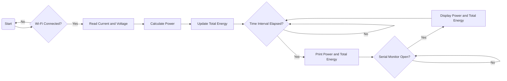

# code 2

This code is designed to monitor energy consumption using an ESP8266 board. It reads the current and voltage values from analog pins, calculates the power and total energy consumed, and prints the values to the serial monitor at regular intervals.

## Prerequisites

Before using this code, make sure you have the following:

- ESP8266 board
- Wi-Fi network credentials (SSID and password)

## Circuit Connection

Make sure you have connected your current and voltage sensors correctly to the ESP8266 board. Connect the current sensor output to analog pin A0 and the voltage sensor output to analog pin A1.

## Configuration

Before uploading the code, you need to provide the necessary configuration details:

- Replace `YOUR_WIFI_SSID` with the SSID (name) of your Wi-Fi network.
- Replace `YOUR_WIFI_PASSWORD` with the password of your Wi-Fi network.

## Usage

1. Upload the code to your ESP8266 board.
2. Open the serial monitor with a baud rate of 115200 to view the debugging information.
3. The ESP8266 will attempt to connect to the Wi-Fi network. Once connected, it will display a message indicating the successful connection.
4. The code continuously reads the current and voltage values from the sensors, calculates the power, and updates the total energy consumed.
5. Every 5 seconds, the power value (in watts) and total energy (in kilowatt-hours) are printed to the serial monitor.
6. Monitor the serial monitor to observe the power consumption and total energy readings.

## Flowchart

## Notes

- The `currentRatio` variable represents the ratio of the current transformer used. Modify this value according to the specifications of your current sensor.
- The `voltageDividerResistor1` and `voltageDividerResistor2` variables represent the resistors used in the voltage divider circuit. Adjust these values based on your voltage sensor setup.

Please note that this code is provided as a starting point and may need to be modified to fit your specific requirements.

Happy energy monitoring!
