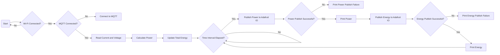

# code 3

This code is designed to monitor energy consumption using an Arduino board and publish the power and total energy values to Adafruit IO MQTT service. It reads the current and voltage values from analog pins, calculates the power and total energy, and publishes them to Adafruit IO feeds at regular intervals.

## Prerequisites

Before using this code, make sure you have the following:

- Arduino board (compatible with Adafruit MQTT library)
- Wi-Fi network credentials (SSID and password)
- Adafruit IO account (username and key)

## Dependencies

This code requires the following libraries:

- `Adafruit_MQTT.h`
- `Adafruit_MQTT_Client.h`

Make sure you have these libraries installed in your Arduino IDE.

## Circuit Connection

Make sure you have connected your current and voltage sensors correctly to the Arduino board. Connect the current sensor output to analog pin A0 and the voltage sensor output to analog pin A1.

## Configuration

Before uploading the code, you need to provide the necessary configuration details:

- Replace `YOUR_WIFI_SSID` with the SSID (name) of your Wi-Fi network.
- Replace `YOUR_WIFI_PASSWORD` with the password of your Wi-Fi network.
- Replace `YOUR_ADAFRUIT_USERNAME` with your Adafruit IO username.
- Replace `YOUR_ADAFRUIT_KEY` with your Adafruit IO key.

## Usage

1. Upload the code to your Arduino board.
2. Open the serial monitor to view the debugging information.
3. The Arduino will attempt to connect to the Wi-Fi network. Once connected, it will establish a connection to the Adafruit IO MQTT server.
4. The code continuously reads the current and voltage values from the sensors, calculates the power and total energy, and updates the values.
5. Every 5 seconds, the power and total energy values are published to the respective Adafruit IO feeds. The values are also printed to the serial monitor.
6. Make sure your Adafruit IO feeds are correctly set up to receive the power and total energy data.

## Flowchart

## Troubleshooting

If you encounter any issues, consider the following:

- Double-check your Wi-Fi credentials and Adafruit IO account details.
- Ensure that the current and voltage sensors are correctly connected to the Arduino board.
- Verify that you have the necessary libraries installed in your Arduino IDE.

## Note

Please note that this code is provided as a starting point and may need to be modified to fit your specific requirements. Refer to the official documentation of the Adafruit MQTT library for detailed usage instructions.

Happy energy monitoring and publishing!
